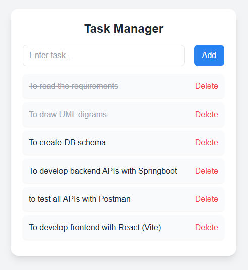

#  TypeScript Task Manager

A simple and clean task management app built using React, TypeScript, and TailwindCSS.

##  Features
- Add tasks
- Mark tasks as completed
- Delete tasks
- Persistent storage using localStorage

##  Tech Stack
- React (Vite)
- TypeScript
- TailwindCSS
- LocalStorage(no backend)

##  Installation

```bash
npm install
npm run dev

```
## Purpose
This project demonstrates:
- Type-safe development with TypeScript
- Component-based architecture in React
- State management using hooks
- Modern UI styling with TailwindCSS

## Project Structure

```
typescript-task-manager/
│
├── src/
│   ├── components/
│   │   ├── TaskInput.tsx
│   │   ├── TaskList.tsx
│   │   └── TaskItem.tsx
│   ├── types/
│   │   └── Task.ts
│   ├── App.tsx
│   └── main.tsx
│
├── package.json
└── README.md

```
## Preview



## Live Demo: 

https://vermillion-cat-0eed0f.netlify.app/

## Author

Gnanaparvathan Sabapathy
